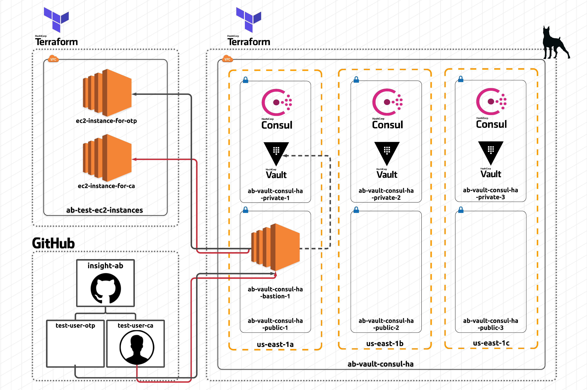

# Easy SSH with Hashicorp Vault on AWS

Combining secrets and identity management to seamlessly provide role-based access to developers in an organization using [Vault](https://vaultproject.io/). The sourcecode will help with setting up infrastucture on the AWS network using [Terraform](https://terraform.io/).

Vault will securely help store/generate ephemeral secrets to access various resources within the AWS cloud. The role-based access will be provided to users belonging to particular teams within an organization in GitHub.

The following architecture diagram shows how the Vault cluster is fronted by a classic ELB that routes network traffic to the Vault servers:



The source code is inspired by Hashicorp's best practices guide that can be found [here](https://github.com/hashicorp/vault-guides/tree/master/operations/provision-vault/best-practices/terraform-aws) along with the following webinars:

- [Best Practices for Using HashiCorp Terraform with HashiCorp Vault](https://www.hashicorp.com/resources/best-practices-using-hashicorp-terraform-with-hashicorp-vault)

- [Manage SSH with HashiCorp Vault](https://www.hashicorp.com/resources/manage-ssh-with-hashicorp-vault)

## Reference Material

- [Terraform Getting Started](https://www.terraform.io/intro/getting-started/install.html)
- [Terraform Docs](https://www.terraform.io/docs/index.html)
- [Consul Getting Started](https://www.consul.io/intro/getting-started/install.html)
- [Consul Docs](https://www.consul.io/docs/index.html)
- [Vault Getting Started](https://learn.hashicorp.com/vault/getting-started/install)
- [Vault Docs](https://www.vaultproject.io/docs/index.html)

## Getting Started

Follow along to quickly set up all your infrastructure and have it (production) ready in minutes.

### Prerequisites

Things you will need to install:

- [Terraform](https://www.terraform.io/downloads.html)
- [Vault](https://www.vaultproject.io/downloads/)
- [Packer](https://packer.io/downloads.html)
- [Ansible](https://docs.ansible.com/ansible/latest/installation_guide/intro_installation.html)

## Steps

### Step 1: Set up a private Certificate Authority

Follow instructions in the [private-tls-cert](https://github.com/abaiju15/git-ssh-with-vault/tree/master/modules/private-tls-cert) directory of this repository to create a CA public key along with public/private keys for a TLS
certificate signed by this CA.

You will want to modify some of the variables in [variables.tf](https://github.com/abaiju15/git-ssh-with-vault/tree/master/modules/private-tls-cert/variables.tf) based on your individual needs. Once these certificates are generated, you will bake them into your AMIs in the next step.

### Step 2: Generate an AMI to use for deployment of Vault/Consul clusters

Follow instructions in the [vault-consul-ami](https://github.com/abaiju15/git-ssh-with-vault/tree/master/vault-consul-ami) directory of this repository to create an AMI of your choice. Ubuntu-18 is the recommended OS as it has proved to work well with the rest of the modules in this project (`packer build -only ubuntu18-ami vault-consul.json`).

### Step 3: Initialize the Vault & Consul cluster

Initialize Terraform - download providers and modules. Run a `terraform plan` to ensure Terraform will provision what you expect. Run a `terraform apply` to provision the HashiStack. Once provisioned, view the `zREADME` instructions output from Terraform for next steps.

```sh
> terraform init
> terraform plan
> terraform apply
```

### Step 4: Initialize target EC2 servers

Go into the `terraform-aws-ssh-clients` directory and modify variables in `variables.tf` as necessary. Then run the same terraform commands as before to initialize, plan, and then apply the changes in AWS:

```sh
> terraform init
> terraform plan
> terraform apply
```

Make note of the public ip addresses that get written out to the console. These are the IPs you will use on your ansible hosts file in the next step.

### Step 5: Configure EC2 servers based on your requirements

Create a file named `hosts` in `/etc/ansible/` on your local machine and add the following code-snippet (replacing the public IPs and the access key paths with your corresponding values):

```
[ca_ssh_clients]
50.16.152.201 ansible_ssh_private_key_file=/Users/ashishbaiju/.ssh/ab-main.pem

[otp_ssh_clients]
34.225.211.99 ansible_ssh_private_key_file=/Users/ashishbaiju/.ssh/ab-main.pem
```

Go into the `ansible` directory within the `terraform-aws-ssh-clients` directory and run the following commands to configure your remote hosts as desired (peek into the yaml files to see how the hosts group is defined - this is what's looked at in your main hosts file in `/etc/ansible/hosts`):

```sh
> ansible-playbook ca-playbook.yaml
> ansible-playbook otp-playbook.yaml
```

### Step 6: Set up local machine to connect to Vault

Now that you have your infrastructure setup, you can connect to Vault via the ELB. Because you have used self-signed TLS certificates to setup the infra, you will need to trust the CA on your keychain (macOS). Once this is done, navigate to your DNS endpoint that you setup with Route53 earlier. In my case it is `https://vault.insight-ab.net`. You can still use the DNS endpoint for the ELB as well to connect instead - something like `https://vault-ab-406229621.us-east-1.elb.amazonaws.com`.

Follow these instructions to login to your Vault after it has been unsealed:

```sh
> vault login
> ## this is when you will be prompted for a token
> vault login -method=github
> ## this is for your users to login with their GitHub access tokens
```

To set up Vault with the OTP/CA configuration, you can run the `configure-vault.sh` script in the scripts directory once logged in with your root credentials on an unsealed Vault. Please update the config files within `policies` & `roles` according to your own needs.

For a full recording of the project, please visit [here](https://youtu.be/KTgpCFpkrV8).

## Built With

- [Packer](https://packer.io/) - Used to build AMIs on AWS
- [Terraform](https://terraform.io/) - Used to provision the infrastructure
- [Vault](https://vaultproject.io/) - Secrets & identity management
- [Consul](https://consul.io/) - Resilient backend/storage for Vault
- [Ansible](https://www.ansible.com) - Configure EC2 servers after provisioning

## Acknowledgments

- [Rob Cannon](https://github.com/robc-io/)
- [Erik R. Rygg](https://github.com/errygg/)
- [Becca Petrin](https://github.com/tyrannosaurus-becks)
