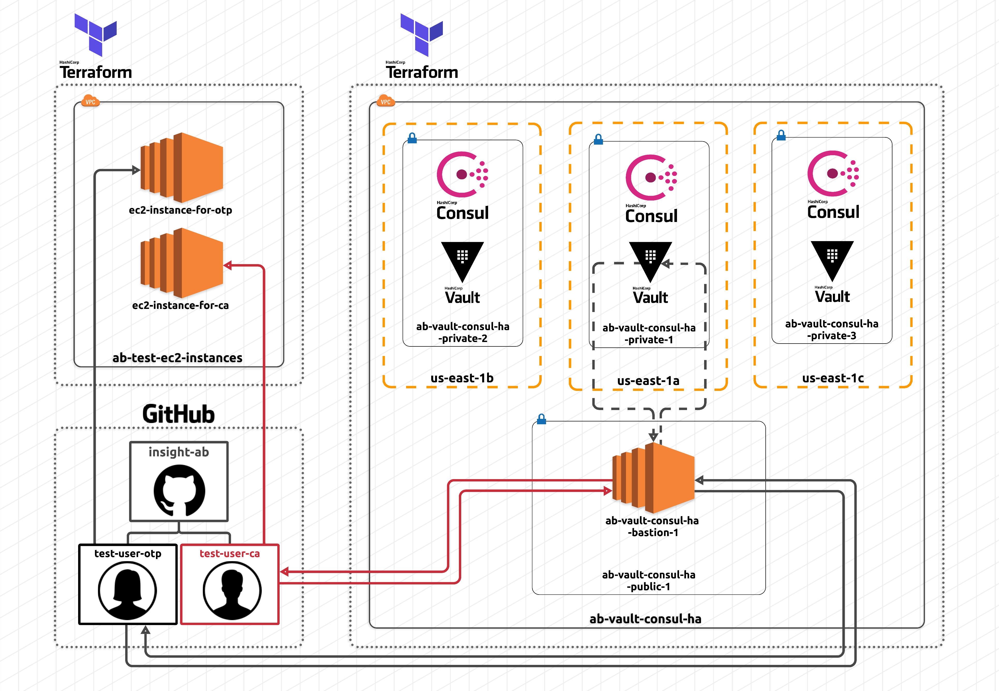

# Easy SSH with Hashicorp Vault on AWS

Combining secrets and identity management to seamlessly provide role-based access to developers in an organization using [Vault](https://vaultproject.io/). The sourcecode will help with setting up infrastucture on the AWS network using [Terraform](https://terraform.io/).

Vault will securely help store/generate ephemeral secrets to access various resources within the AWS cloud. The role-based access will be provided to users belonging to particular teams within an organization in GitHub.

The following architecture diagram shows how the Vault cluster is fronted by a classic ELB that routes network traffic to the Vault servers:



The source code is inspired by Hashicorp's best practices guide that can be found [here](https://github.com/hashicorp/vault-guides/tree/master/operations/provision-vault/best-practices/terraform-aws) along with the following webinars:

- [Best Practices for Using HashiCorp Terraform with HashiCorp Vault](https://www.hashicorp.com/resources/best-practices-using-hashicorp-terraform-with-hashicorp-vault)

- [Manage SSH with HashiCorp Vault](https://www.hashicorp.com/resources/manage-ssh-with-hashicorp-vault)

## Reference Material

- [Terraform Getting Started](https://www.terraform.io/intro/getting-started/install.html)
- [Terraform Docs](https://www.terraform.io/docs/index.html)
- [Consul Getting Started](https://www.consul.io/intro/getting-started/install.html)
- [Consul Docs](https://www.consul.io/docs/index.html)
- [Vault Getting Started](https://learn.hashicorp.com/vault/getting-started/install)
- [Vault Docs](https://www.vaultproject.io/docs/index.html)

## Getting Started

Follow along to quickly set up all your infrastructure and have it production ready in minutes.

### Prerequisites

Things you will need to install:

- [Terraform](https://www.terraform.io/downloads.html) (you can forgo this if you're going to install Terraform Switcher)

## Steps

### Step 1: Initialize the Vault & Consul cluster

Initialize Terraform - download providers and modules.

```sh
$ terraform init
```

### Step 2: Get Terraform to spit out a plan

Run a `terraform plan` to ensure Terraform will provision what you expect.

```sh
$ terraform plan
```

### Step 3: Apply the plan after reviewing

Run a `terraform apply` to provision the HashiStack. Once provisioned, view the `zREADME` instructions output from Terraform for next steps.

```sh
$ terraform apply
```

## Built With

- [Terraform](https://terraform.io/) - Used to provision the infrastructure
- [Vault](https://vaultproject.io/) - Secrets & identity management
- [Consul](https://consul.io/) - Resilient backend/storage for Vault

## Acknowledgments

- [Rob Cannon](https://github.com/robc-io/)
- [Erik R. Rygg](https://github.com/errygg/)
- [Becca Petrin](https://github.com/tyrannosaurus-becks)
